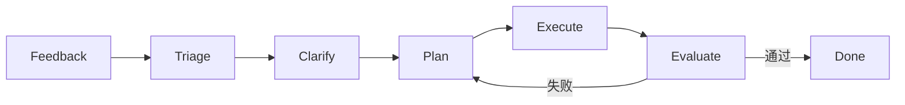

# 使用OpenCode从一个空白仓库实践Harness Engineering的实战指南

> **版本**: 1.0  
> **更新日期**: 2025年1月  
> **适用工具**: OpenCode, DeerFlow 2.0

---

## 目录

1. [前言：Harness Engineering概述](#1-前言harness-engineering概述)
2. [OpenCode工具介绍](#2-opencode工具介绍)
3. [相关Skill评估](#3-相关skill评估)
4. [从零开始构建Harness](#4-从零开始构建harness)
5. [核心组件实现](#5-核心组件实现)
6. [完整工作流实现](#6-完整工作流实现)
7. [测试与评估策略](#7-测试与评估策略)
8. [长期进化规划](#8-长期进化规划)
9. [实施路线图](#9-实施路线图)
10. [最佳实践与常见陷阱](#10-最佳实践与常见陷阱)
11. [附录：快速参考](#11-附录快速参考)

---

## 1. 前言：Harness Engineering概述

### 1.1 什么是Harness Engineering

Harness Engineering（约束工程）是AI编程范式的第三层演进，它代表了一种系统化的AI辅助软件开发方法论。

**核心公式**:
```
Agent = Model + Harness
```

这个公式揭示了现代AI编程的本质：
- **Model（模型）**: 大语言模型（LLM）的推理和生成能力
- **Harness（约束系统）**: 围绕模型的结构化框架，包括上下文管理、工作流编排、验证机制等
- **Agent（智能体）**: 能够自主完成复杂任务的完整系统

### 1.2 三层架构演进

| 层级 | 名称 | 核心关注点 | 代表工具 |
|------|------|-----------|---------|
| L1 | Prompt Engineering | 单次提示优化 | ChatGPT, Claude |
| L2 | Context Engineering | 上下文管理 | RAG, 知识库 |
| L3 | Harness Engineering | 系统化约束框架 | OpenCode, DeerFlow 2.0 |

### 1.3 Harness Engineering的四大支柱

```
┌─────────────────────────────────────────────────────────┐
│                    Harness Engineering                   │
├─────────────┬─────────────┬─────────────┬───────────────┤
│  约束系统    │  信息系统    │  验证系统    │   修正系统     │
│ Constraints │ Information │  Validation │   Correction  │
├─────────────┼─────────────┼─────────────┼───────────────┤
│ • 工作流定义 │ • 上下文管理 │ • 测试验证  │ • 错误诊断    │
│ • 角色边界   │ • 知识检索   │ • 质量评估  │ • 自动修复    │
│ • 安全规则   │ • 状态持久化 │ • 性能监控  │ • 迭代优化    │
└─────────────┴─────────────┴─────────────┴───────────────┘
```

### 1.4 为什么需要Harness Engineering

根据OpenAI的百万行代码实验（3名工程师+5个月+零人工编写代码），Harness Engineering能够：

1. **提升代码质量**: 通过系统化的验证和修正机制
2. **保证一致性**: 标准化的工作流和代码规范
3. **降低认知负担**: 智能体自主处理复杂任务
4. **实现可扩展性**: 模块化设计支持团队协作
5. **提供可观测性**: 完整的执行日志和性能指标

---

## 2. OpenCode工具介绍

### 2.1 OpenCode定位与特性

OpenCode是一个**代码生成与编辑引擎**，采用**Plan + Build双代理模式**架构：

```
┌────────────────────────────────────────┐
│           OpenCode Architecture         │
├──────────────────┬─────────────────────┤
│    Plan Agent    │     Build Agent      │
│    (规划代理)     │     (构建代理)       │
├──────────────────┼─────────────────────┤
│ • 任务分解        │ • 代码生成          │
│ • 依赖分析        │ • 代码编辑          │
│ • 策略制定        │ • 重构优化          │
│ • 风险评估        │ • 文档生成          │
└──────────────────┴─────────────────────┘
         ↓                    ↓
    ┌─────────────────────────────┐
    │      Shared Context Pool     │
    │       (共享上下文池)          │
    └─────────────────────────────┘
```

**核心特性**:

| 特性 | 描述 | 优势 |
|------|------|------|
| 双代理模式 | Plan + Build分离 | 职责清晰，可独立优化 |
| 上下文感知 | 智能上下文管理 | 避免"上下文焦虑" |
| 技能系统 | 可插拔的Skill机制 | 功能可扩展 |
| 工作流编排 | 七阶段标准流程 | 过程可控可观测 |
| 多模型支持 | 兼容多种LLM | 灵活选择后端 |

### 2.2 安装与配置

#### 2.2.1 环境要求

```bash
# 系统要求
- Python 3.10+
- Node.js 18+
- Git 2.30+
- 8GB+ RAM (推荐16GB)

# 可选依赖
- Docker (用于沙箱隔离)
- Miniconda/Mamba (用于Python环境管理)
```

#### 2.2.2 安装步骤

```bash
# 1. 安装OpenCode CLI
npm install -g @opencode/cli

# 2. 验证安装
opencode --version

# 3. 配置API密钥
opencode config set openai.api_key YOUR_API_KEY
opencode config set anthropic.api_key YOUR_API_KEY

# 4. 初始化项目
opencode init my-project
cd my-project
```

#### 2.2.3 配置文件示例

```yaml
# opencode.yaml
version: "1.0"

# 模型配置
model:
  provider: "anthropic"  # 或 "openai"
  model: "claude-3-5-sonnet-20241022"
  temperature: 0.7
  max_tokens: 4096

# 代理配置
agents:
  plan:
    temperature: 0.3  # 规划需要更确定性
    max_iterations: 5
  build:
    temperature: 0.7  # 构建需要一定创造性
    max_iterations: 10

# 技能配置
skills:
  - ohmyopencode
  - superpowers
  - openspec
  - spec-kit

# 工作流配置
workflow:
  stages:
    - feedback
    - triage
    - clarify
    - plan
    - execute
    - evaluate
    - done
  auto_retry: true
  max_retries: 3

# 上下文配置
context:
  max_tokens: 8000
  include_git_history: true
  include_file_tree: true
```

### 2.3 与DeerFlow 2.0的关系

```
┌─────────────────────────────────────────────────────────┐
│                    DeerFlow 2.0                          │
│              (复杂任务编排与执行引擎)                      │
├─────────────────────────────────────────────────────────┤
│  ┌─────────────┐  ┌─────────────┐  ┌─────────────────┐  │
│  │ Skills层    │  │ Sub-Agents  │  │   Sandbox隔离   │  │
│  │ (技能系统)   │  │ (子代理编排) │  │  (安全执行环境)  │  │
│  └─────────────┘  └─────────────┘  └─────────────────┘  │
├─────────────────────────────────────────────────────────┤
│                    OpenCode (集成)                        │
│              (代码生成与编辑引擎)                          │
├─────────────────────────────────────────────────────────┤
│  ┌─────────────┐  ┌─────────────┐  ┌─────────────────┐  │
│  │ Plan Agent  │  │ Build Agent │  │  Context Pool   │  │
│  │ (规划代理)   │  │ (构建代理)   │  │  (上下文池)      │  │
│  └─────────────┘  └─────────────┘  └─────────────────┘  │
└─────────────────────────────────────────────────────────┘
```

**关系说明**:
- **OpenCode**专注于代码层面的生成与编辑
- **DeerFlow 2.0**提供更高层的任务编排能力
- 两者通过MCP（Model Context Protocol）标准协议集成
- DeerFlow 2.0可以调用OpenCode完成具体的代码任务

---

## 3. 相关Skill评估

本节重点评估四个核心Skill在Harness Engineering实践中的应用价值。

### 3.1 ohmyopencode插件评估

#### 3.1.1 功能概述

ohmyopencode是OpenCode的官方插件集合，提供增强的代码生成和项目管理能力。

**核心功能**:
```
ohmyopencode/
├── commands/          # 扩展命令
│   ├── init.py       # 项目初始化
│   ├── analyze.py    # 代码分析
│   └── refactor.py   # 重构助手
├── templates/         # 代码模板
│   ├── python/       # Python项目模板
│   ├── javascript/   # JavaScript项目模板
│   └── typescript/   # TypeScript项目模板
└── integrations/      # 第三方集成
    ├── github.py     # GitHub集成
    └── gitlab.py     # GitLab集成
```

#### 3.1.2 Harness Engineering应用评估

| 评估维度 | 评分 | 说明 |
|---------|------|------|
| 项目初始化 | ★★★★★ | 提供标准化的项目结构模板 |
| 代码生成 | ★★★★☆ | 模板丰富，但需自定义适配Harness |
| 上下文管理 | ★★★☆☆ | 基础功能，需配合其他Skill |
| 工作流支持 | ★★★☆☆ | 需扩展以支持七阶段流程 |
| 可扩展性 | ★★★★☆ | 插件机制良好，易于定制 |

#### 3.1.3 适用场景

```python
# 场景1: 快速初始化Harness项目
# opencode ohmyopencode init --template harness-python

# 场景2: 代码分析与重构
# opencode ohmyopencode analyze --target src/agents/

# 场景3: 生成标准组件
# opencode ohmyopencode generate --type evaluator --name my_evaluator
```

#### 3.1.4 集成建议

```yaml
# 在opencode.yaml中配置
skills:
  ohmyopencode:
    enabled: true
    config:
      templates_dir: ".harness/templates"
      auto_format: true
      lint_on_save: true
      # Harness专用配置
      harness:
        default_runner: "asyncio"
        evaluator_framework: "pytest"
        plan_format: "json"
```

#### 3.1.5 注意事项

1. **模板定制**: 默认模板需要针对Harness Engineering进行调整
2. **版本兼容**: 注意与OpenCode核心版本的兼容性
3. **性能影响**: 大型项目分析可能消耗较多Token

---

### 3.2 superpowers评估

#### 3.2.1 功能概述

superpowers是一个工作流编排Skill，提供**七步标准工作流**：

```
superpowers工作流:
┌─────────┐    ┌─────────┐    ┌─────────┐    ┌─────────┐
│  Step 1 │ → │  Step 2 │ → │  Step 3 │ → │  Step 4 │
│  Scope  │    │  Design │    │  Develop│    │  Test   │
│ (范围)  │    │ (设计)  │    │ (开发)  │    │ (测试)  │
└─────────┘    └─────────┘    └─────────┘    └─────────┘
                                              ↓
┌─────────┐    ┌─────────┐    ┌─────────┐    ┌─────────┐
│  Step 7 │ ← │  Step 6 │ ← │  Step 5 │ ← │  Step 4 │
│  Deploy │    │  Review │    │  Refine │    │  Test   │
│ (部署)  │    │ (审查)  │    │ (优化)  │    │ (测试)  │
└─────────┘    └─────────┘    └─────────┘    └─────────┘
```

#### 3.2.2 与Harness Engineering的映射

```
superpowers七步 ↔ Harness七阶段映射:

Scope (范围定义)      →  Feedback + Triage + Clarify
Design (设计规划)     →  Plan
Develop (开发实现)    →  Execute
Test (测试验证)       →  Evaluate
Refine (优化迭代)     →  Evaluate (重试分支)
Review (审查确认)     →  Evaluate (人工审查)
Deploy (部署交付)     →  Done
```

#### 3.2.3 Harness Engineering应用评估

| 评估维度 | 评分 | 说明 |
|---------|------|------|
| 流程完整性 | ★★★★★ | 七步覆盖完整开发周期 |
| Harness适配 | ★★★★☆ | 需要微调以完全对齐 |
| 状态管理 | ★★★★☆ | 内置状态机，支持持久化 |
| 可观测性 | ★★★★☆ | 提供详细执行日志 |
| 协作支持 | ★★★☆☆ | 需要扩展多人协作功能 |

#### 3.2.4 适用场景

```python
# 场景1: 功能开发完整流程
# opencode superpowers run --workflow feature --input "添加用户认证"

# 场景2: Bug修复流程
# opencode superpowers run --workflow bugfix --input "修复登录超时问题"

# 场景3: 重构任务
# opencode superpowers run --workflow refactor --input "优化数据库查询"
```

#### 3.2.5 集成建议

```yaml
# opencode.yaml配置
skills:
  superpowers:
    enabled: true
    config:
      # 映射到Harness七阶段
      workflow_mapping:
        scope: ["feedback", "triage", "clarify"]
        design: ["plan"]
        develop: ["execute"]
        test: ["evaluate"]
        refine: ["evaluate"]  # 重试路径
        review: ["evaluate"]  # 人工审查
        deploy: ["done"]
      
      # 评估器集成
      evaluator:
        enabled: true
        auto_retry: true
        max_retries: 3
      
      # 状态持久化
      persistence:
        backend: "json"  # 或 "redis", "sqlite"
        path: ".harness/state"
```

#### 3.2.6 注意事项

1. **阶段对齐**: superpowers的七步与Harness七阶段有细微差异，需要明确映射
2. **评估点设置**: 建议在Design和Test阶段强制设置评估点
3. **人工介入**: Review阶段建议保留人工确认环节

---

### 3.3 openspec评估

#### 3.3.1 功能概述

openspec是一个规范定义和文档生成Skill，专注于：
- 需求规格说明（Specification）
- API文档生成
- 代码与文档同步

```
openspec核心能力:
┌─────────────────────────────────────────┐
│           openspec Architecture          │
├─────────────────────────────────────────┤
│  ┌─────────────┐    ┌────────────────┐  │
│  │ Spec Parser │ →  │  Doc Generator │  │
│  │ (规范解析)   │    │  (文档生成)     │  │
│  └─────────────┘    └────────────────┘  │
├─────────────────────────────────────────┤
│  Input Formats:                         │
│  • Markdown (.md)                       │
│  • YAML (.yaml)                         │
│  • OpenAPI (.yaml/.json)                │
│  • Custom DSL (.spec)                   │
└─────────────────────────────────────────┘
```

#### 3.3.2 Harness Engineering应用评估

| 评估维度 | 评分 | 说明 |
|---------|------|------|
| 规范定义 | ★★★★★ | 非常适合定义AGENTS.md |
| 文档同步 | ★★★★☆ | 支持代码-文档双向同步 |
| 计划生成 | ★★★★☆ | 可从规范生成JSON计划 |
| 验收标准 | ★★★★☆ | 支持SMART标准定义 |
| 版本管理 | ★★★☆☆ | 需要配合Git使用 |

#### 3.3.3 适用场景

```python
# 场景1: 从规范生成AGENTS.md
# opencode openspec generate --input specs/ --output AGENTS.md --type agents

# 场景2: 从需求生成测试计划
# opencode openspec generate --input requirements.md --output test_plan.json --type tests

# 场景3: 验证实现与规范一致性
# opencode openspec verify --spec specs/api.yaml --implementation src/
```

#### 3.3.4 集成建议

```yaml
# opencode.yaml配置
skills:
  openspec:
    enabled: true
    config:
      # 规范目录
      specs_dir: "specs"
      
      # 输出配置
      output:
        agents_md: "AGENTS.md"
        context_md: "docs/context.md"
        plans_dir: ".harness/plans"
      
      # 模板配置
      templates:
        agents: ".harness/templates/agents.md.j2"
        plan: ".harness/templates/plan.json.j2"
      
      # 验证规则
      validation:
        require_acceptance_criteria: true
        smart_criteria: true
        max_spec_length: 1000
```

#### 3.3.5 注意事项

1. **规范粒度**: 避免过度详细的规范，保持50-100行的AGENTS.md
2. **同步频率**: 建议每次代码变更后自动同步文档
3. **版本控制**: 规范文件需要纳入版本控制

---

### 3.4 spec-kit评估

#### 3.4.1 功能概述

spec-kit是一个项目初始化和结构标准化Skill，提供：
- 标准化的项目结构模板
- 配置文件生成
- 依赖管理
- 环境初始化

```
spec-kit提供的标准结构:
my-project/
├── .specify/           # spec-kit配置
│   ├── config.yaml
│   └── templates/
├── specs/              # 规范文件
│   ├── README.spec
│   └── features/
├── src/                # 源代码
│   ├── agents/
│   ├── harness/
│   └── utils/
├── tests/              # 测试代码
│   ├── unit/
│   └── integration/
├── configs/            # 配置文件
│   ├── dev.yaml
│   └── prod.yaml
├── docs/
│   └── context.md      # 核心上下文（与 AGENTS.md 分离）
└── AGENTS.md           # 智能体配置
```

#### 3.4.2 Harness Engineering应用评估

| 评估维度 | 评分 | 说明 |
|---------|------|------|
| 项目初始化 | ★★★★★ | 一键生成标准结构 |
| 结构标准化 | ★★★★★ | 强制遵循最佳实践 |
| 配置管理 | ★★★★☆ | 支持多环境配置 |
| 依赖管理 | ★★★★☆ | 集成主流包管理器 |
| 可定制性 | ★★★☆☆ | 模板定制需要一定学习成本 |

#### 3.4.3 适用场景

```python
# 场景1: 初始化Harness项目
# opencode spec-kit init --template harness --name my-harness-project

# 场景2: 添加新组件
# opencode spec-kit add --type evaluator --name security_evaluator

# 场景3: 验证项目结构
# opencode spec-kit validate --strict
```

#### 3.4.4 集成建议

```yaml
# opencode.yaml配置
skills:
  spec-kit:
    enabled: true
    config:
      # 项目模板
      template: "harness-python"
      
      # 目录结构
      structure:
        agents: "src/agents"
        harness: ".harness"
        specs: "specs"
        tests: "tests"
        docs: "docs"
      
      # 必需文件
      required_files:
        - "docs/context.md"
        - "AGENTS.md"
        - "opencode.yaml"
      
      # 初始化钩子
      hooks:
        post_init:
          - "git init"
          - "opencode ohmyopencode init"
          - "opencode openspec generate"
```

#### 3.4.5 注意事项

1. **模板选择**: 选择与项目类型匹配的模板
2. **目录约定**: 遵循spec-kit的目录约定以获得最佳支持
3. **升级策略**: 关注spec-kit版本更新，及时升级模板

---

### 3.5 Skill综合对比与选型建议

```
Skill能力矩阵:
                    ohmyopencode  superpowers  openspec  spec-kit
项目初始化              ★★★★★        ★★★☆☆     ★★★☆☆    ★★★★★
工作流编排              ★★★☆☆        ★★★★★     ★★☆☆☆    ★★★☆☆
规范定义                ★★★☆☆        ★★★☆☆     ★★★★★    ★★★★☆
结构标准化              ★★★★☆        ★★☆☆☆     ★★★☆☆    ★★★★★
代码生成                ★★★★☆        ★★★★☆     ★★★☆☆    ★★★☆☆
文档同步                ★★★☆☆        ★★★☆☆     ★★★★☆    ★★★☆☆
测试集成                ★★★☆☆        ★★★★☆     ★★★★☆    ★★★☆☆
```

**选型建议**:

| 场景 | 推荐Skill组合 |
|------|--------------|
| 从零开始新项目 | spec-kit + ohmyopencode + openspec |
| 已有项目Harness化 | superpowers + openspec |
| 快速原型开发 | ohmyopencode + superpowers |
| 企业级项目 | 全部四个Skill |

---

## 4. 从零开始构建Harness

### 4.1 环境准备（第1天）

#### 4.1.1 基础环境安装

```bash
#!/bin/bash
# setup_env.sh - 环境初始化脚本

echo "=== Harness Engineering环境初始化 ==="

# 1. 安装Miniconda（如果未安装）
if ! command -v conda &> /dev/null; then
    wget https://repo.anaconda.com/miniconda/Miniconda3-latest-Linux-x86_64.sh
    bash Miniconda3-latest-Linux-x86_64.sh -b -p $HOME/miniconda
    export PATH="$HOME/miniconda/bin:$PATH"
fi

# 2. 创建Python环境
conda create -n harness python=3.11 -y
conda activate harness

# 3. 安装OpenCode
npm install -g @opencode/cli

# 4. 安装Python依赖
pip install \
    pydantic>=2.0 \
    pytest>=7.0 \
    pytest-asyncio \
    pytest-cov \
    black \
    isort \
    mypy \
    rich \
    typer \
    pyyaml \
    jsonschema

# 5. 验证安装
opencode --version
python --version

echo "=== 环境初始化完成 ==="
```

#### 4.1.2 Docker环境（可选）

```dockerfile
# Dockerfile.harness
FROM python:3.11-slim

WORKDIR /app

# 安装系统依赖
RUN apt-get update && apt-get install -y \
    git \
    nodejs \
    npm \
    && rm -rf /var/lib/apt/lists/*

# 安装OpenCode
RUN npm install -g @opencode/cli

# 复制依赖
COPY requirements.txt .
RUN pip install -r requirements.txt

# 复制项目代码
COPY . .

# 设置环境变量
ENV PYTHONPATH=/app
ENV HARNESS_MODE=production

CMD ["opencode", "run"]
```

```yaml
# docker-compose.yaml
version: '3.8'

services:
  harness:
    build:
      context: .
      dockerfile: Dockerfile.harness
    volumes:
      - .:/app
      - harness_state:/app/.harness/state
    environment:
      - OPENAI_API_KEY=${OPENAI_API_KEY}
      - ANTHROPIC_API_KEY=${ANTHROPIC_API_KEY}
    command: opencode run

  harness-dev:
    build:
      context: .
      dockerfile: Dockerfile.harness
    volumes:
      - .:/app
    environment:
      - HARNESS_MODE=development
    command: /bin/bash
    stdin_open: true
    tty: true

volumes:
  harness_state:
```

### 4.2 项目结构设计

#### 4.2.1 标准目录结构

```
my-harness-project/
│
├── .claude/                    # Claude/AI相关配置
│   └── skills/                # Skill配置
│       ├── ohmyopencode/
│       ├── superpowers/
│       ├── openspec/
│       └── spec-kit/
│
├── .harness/                   # Harness核心目录
│   ├── plans/                 # JSON计划文件
│   │   ├── plan_001.json
│   │   └── plan_002.json
│   ├── eval_feedback/         # 评估反馈
│   │   ├── eval_001.json
│   │   └── eval_002.json
│   ├── state/                 # 状态持久化
│   │   └── state.json
│   ├── templates/             # 模板文件
│   │   ├── agents.md.j2
│   │   ├── plan.json.j2
│   │   └── evaluator.py.j2
│   └── logs/                  # 执行日志
│       └── harness.log
│
├── .specify/                   # spec-kit配置
│   └── config.yaml
│
├── specs/                      # 规范文件
│   ├── README.spec
│   ├── features/
│   │   ├── feature_001_auth.spec
│   │   └── feature_002_api.spec
│   └── api/
│       └── openapi.yaml
│
├── src/                        # 源代码
│   ├── __init__.py
│   ├── agents/                # 智能体实现
│   │   ├── __init__.py
│   │   ├── planner.py        # 规划代理
│   │   ├── generator.py      # 生成代理
│   │   └── evaluator.py      # 评估代理
│   ├── harness/               # Harness核心
│   │   ├── __init__.py
│   │   ├── runner.py         # 执行器
│   │   ├── evaluator.py      # 评估器
│   │   ├── state.py          # 状态管理
│   │   └── workflow.py       # 工作流
│   ├── tools/                 # 工具函数
│   │   ├── __init__.py
│   │   ├── git_utils.py
│   │   └── file_utils.py
│   └── utils/                 # 通用工具
│       ├── __init__.py
│       └── helpers.py
│
├── tests/                      # 测试代码
│   ├── __init__.py
│   ├── unit/                  # 单元测试
│   │   ├── test_runner.py
│   │   └── test_evaluator.py
│   ├── integration/           # 集成测试
│   │   └── test_workflow.py
│   └── fixtures/              # 测试数据
│       └── sample_plan.json
│
├── configs/                    # 配置文件
│   ├── dev.yaml
│   ├── test.yaml
│   └── prod.yaml
│
├── docs/                       # 文档
│   ├── architecture.md
│   ├── api.md
│   └── context.md              # 核心上下文文档（与 AGENTS.md 分离）
│
├── AGENTS.md                   # 智能体配置（50-100行，只放地图）
├── opencode.yaml               # OpenCode配置
├── requirements.txt            # Python依赖
├── pytest.ini                # Pytest配置
├── .gitignore
└── README.md
```

> **文档分离原则**: `AGENTS.md` 是智能体的快速参考地图，必须精简（50-100行）。深层上下文（架构细节、历史决策、领域知识）应单独存放在 `docs/context.md` 或 `docs/architecture.md` 中，避免与 AGENTS.md 冲突和冗余。

#### 4.2.2 目录职责说明

| 目录 | 职责 | 关键文件 |
|------|------|---------|
| `.harness/` | Harness运行时数据 | plans/, state/, logs/ |
| `src/agents/` | 智能体实现 | planner.py, generator.py, evaluator.py |
| `src/harness/` | Harness核心组件 | runner.py, evaluator.py, workflow.py |
| `specs/` | 规范和需求 | *.spec, openapi.yaml |
| `tests/` | 测试代码 | unit/, integration/ |
| `docs/` | 项目文档 | architecture.md, context.md |

### 4.3 AGENTS.md 编写规范

#### 4.3.1 AGENTS.md模板

```markdown
# AGENTS.md - 智能体配置

> **原则**: 控制在50-100行，作为智能体的"地图"。深层上下文（架构细节、历史决策、领域知识）请移步 `docs/context.md` 或 `docs/architecture.md`，不要堆在 AGENTS.md 中。

## 1. 项目概述

**项目名称**: [项目名称]
**技术栈**: [Python/Node.js/Go等]
**核心目标**: [一句话描述]

## 2. 智能体角色定义

### 2.1 Plan Agent (规划代理)

**职责**:
- 任务分解与依赖分析
- 生成执行计划
- 风险评估

**输入**: 用户需求、项目上下文
**输出**: JSON格式的执行计划

### 2.2 Build Agent (构建代理)

**职责**:
- 代码生成与编辑
- 重构优化
- 文档生成

**输入**: 执行计划、相关代码
**输出**: 修改后的代码

### 2.3 Evaluator Agent (评估代理)

**职责**:
- 代码质量评估
- 测试执行
- 验收标准验证

**输入**: 代码变更、测试用例
**输出**: 评估报告

## 3. 工作流定义



## 4. 关键约束

- **代码风格**: [PEP8/Prettier等]
- **测试覆盖**: [最低覆盖率要求]
- **文档要求**: [函数必须包含docstring]

## 5. 文件映射

| 文件类型 | 位置 | 说明 |
|---------|------|------|
| 智能体 | `src/agents/` | 代理实现 |
| 计划 | `.harness/plans/` | JSON计划 |
| 评估 | `.harness/eval_feedback/` | 评估反馈 |
```

#### 4.3.2 上下文文档（docs/context.md）模板

> **为什么不放在 AGENTS.md 里？** AGENTS.md 是智能体每次会话都要快速加载的"地图"，必须精简。如果把架构细节、历史决策、领域知识全塞进去，会导致地图臃肿、更新冲突、上下文窗口浪费。因此，深层上下文应单独成文，放在 `docs/` 目录下。

```markdown
# docs/context.md - 项目核心上下文

## 1. 项目元数据

```yaml
name: [项目名称]
version: [版本]
type: [web-app/cli/library]
tech_stack:
  language: [Python 3.11]
  framework: [FastAPI/Flask/Django]
  database: [PostgreSQL/MongoDB]
```

## 2. 架构概览

```
[架构图或文字描述]
```

## 3. 关键约定

### 3.1 代码组织
- 所有智能体放在 `src/agents/`
- 所有测试放在 `tests/`
- 配置文件放在 `configs/`

### 3.2 命名规范
- 类名: PascalCase
- 函数: snake_case
- 常量: UPPER_SNAKE_CASE

### 3.3 提交规范
```
<type>: <subject>

<body>

types: feat, fix, docs, test, refactor, chore
```

## 4. 开发工作流

1. 阅读 `AGENTS.md` 了解智能体配置
2. 需要深层上下文时查阅本文件
3. 检查 `.harness/plans/` 中的待执行计划
4. 遵循七阶段工作流
5. 提交前运行测试: `pytest`

## 5. 常见任务

### 5.1 添加新功能
```bash
# 1. 创建规范
opencode openspec create --type feature

# 2. 生成计划
opencode superpowers run --workflow feature

# 3. 执行并评估
python -m {package_name}.harness.runner .harness/plans/latest.json
```

### 5.2 修复Bug
```bash
# 1. 创建修复计划
opencode superpowers run --workflow bugfix

# 2. 执行修复
python -m {package_name}.harness.runner .harness/plans/bugfix.json
```

## 6. 重要文件

| 文件 | 用途 |
|------|------|
| `AGENTS.md` | 智能体快速参考地图 |
| `docs/context.md` | 深层上下文（本文件） |
| `opencode.yaml` | OpenCode配置 |
| `.harness/plans/` | 执行计划 |
| `tests/` | 测试代码 |
```

### 4.4 第一个可运行的Harness（第2天）

#### 4.4.1 初始化项目

```bash
# 1. 使用spec-kit初始化
opencode spec-kit init --template harness-python --name my-first-harness
cd my-first-harness

# 2. 生成AGENTS.md和上下文文档
opencode openspec generate --type agents --output AGENTS.md
opencode openspec generate --type context --output docs/context.md

# 3. 初始化Git
git init
git add .
git commit -m "chore: initial harness setup"
```

#### 4.4.2 核心组件快速实现

```python
# src/harness/runner.py - 最小可运行执行器
"""
Harness执行器 - 最小可运行版本
"""
import json
import asyncio
from pathlib import Path
from typing import Dict, Any, List
from dataclasses import dataclass
from enum import Enum

class TaskStatus(Enum):
    PENDING = "pending"
    RUNNING = "running"
    SUCCESS = "success"
    FAILED = "failed"

@dataclass
class Task:
    id: str
    name: str
    command: str
    status: TaskStatus = TaskStatus.PENDING
    output: str = ""
    error: str = ""

class HarnessRunner:
    """Harness执行器"""
    
    def __init__(self, plans_dir: str = ".harness/plans"):
        self.plans_dir = Path(plans_dir)
        self.plans_dir.mkdir(parents=True, exist_ok=True)
    
    async def run_plan(self, plan_path: str) -> Dict[str, Any]:
        """执行计划"""
        with open(plan_path) as f:
            plan = json.load(f)
        
        results = []
        for task_data in plan.get("tasks", []):
            task = Task(
                id=task_data["id"],
                name=task_data["name"],
                command=task_data["command"]
            )
            result = await self._execute_task(task)
            results.append(result)
            
            # 如果任务失败且配置了停止
            if result["status"] == "failed" and plan.get("stop_on_error", True):
                break
        
        return {
            "plan_id": plan["id"],
            "status": "success" if all(r["status"] == "success" for r in results) else "failed",
            "tasks": results
        }
    
    async def _execute_task(self, task: Task) -> Dict[str, Any]:
        """执行单个任务"""
        task.status = TaskStatus.RUNNING
        
        try:
            # 模拟任务执行
            await asyncio.sleep(0.1)
            task.status = TaskStatus.SUCCESS
            task.output = f"Task {task.name} completed"
        except Exception as e:
            task.status = TaskStatus.FAILED
            task.error = str(e)
        
        return {
            "id": task.id,
            "name": task.name,
            "status": task.status.value,
            "output": task.output,
            "error": task.error
        }

# 简单使用示例
if __name__ == "__main__":
    runner = HarnessRunner()
    
    # 创建示例计划
    sample_plan = {
        "id": "plan_001",
        "name": "Hello Harness",
        "tasks": [
            {"id": "task_1", "name": "Say Hello", "command": "echo 'Hello'"},
            {"id": "task_2", "name": "Say World", "command": "echo 'World'"}
        ]
    }
    
    plan_path = ".harness/plans/plan_001.json"
    with open(plan_path, "w") as f:
        json.dump(sample_plan, f, indent=2)
    
    # 执行计划
    result = asyncio.run(runner.run_plan(plan_path))
    print(json.dumps(result, indent=2))
```

```python
# src/harness/evaluator.py - 最小可运行评估器
"""
Harness评估器 - 最小可运行版本
"""
import json
from pathlib import Path
from typing import Dict, Any, List
from dataclasses import dataclass

@dataclass
class EvaluationResult:
    passed: bool
    score: float  # 0-100
    criteria: Dict[str, Any]
    feedback: str

class HarnessEvaluator:
    """Harness评估器"""
    
    def __init__(self, feedback_dir: str = ".harness/eval_feedback"):
        self.feedback_dir = Path(feedback_dir)
        self.feedback_dir.mkdir(parents=True, exist_ok=True)
    
    def evaluate(self, result: Dict[str, Any], criteria: Dict[str, Any]) -> EvaluationResult:
        """评估执行结果"""
        
        # 基础评估逻辑
        checks = []
        
        # 1. 检查状态
        status_check = result.get("status") == "success"
        checks.append(("status", status_check, 40))
        
        # 2. 检查任务完成率
        tasks = result.get("tasks", [])
        if tasks:
            completed = sum(1 for t in tasks if t.get("status") == "success")
            completion_rate = completed / len(tasks)
            checks.append(("completion", completion_rate >= 0.8, 30))
        
        # 3. 检查错误
        has_errors = any(t.get("error") for t in tasks)
        checks.append(("no_errors", not has_errors, 30))
        
        # 计算总分
        score = sum(weight for _, passed, weight in checks if passed)
        passed = score >= criteria.get("min_score", 70)
        
        # 生成反馈
        feedback_parts = []
        for name, passed, weight in checks:
            status = "✓" if passed else "✗"
            feedback_parts.append(f"{status} {name} ({weight}pts)")
        
        return EvaluationResult(
            passed=passed,
            score=score,
            criteria={name: passed for name, passed, _ in checks},
            feedback="\n".join(feedback_parts)
        )
    
    def save_feedback(self, plan_id: str, result: EvaluationResult):
        """保存评估反馈"""
        feedback_path = self.feedback_dir / f"eval_{plan_id}.json"
        
        feedback_data = {
            "plan_id": plan_id,
            "passed": result.passed,
            "score": result.score,
            "criteria": result.criteria,
            "feedback": result.feedback
        }
        
        with open(feedback_path, "w") as f:
            json.dump(feedback_data, f, indent=2)
        
        return feedback_path

# 使用示例
if __name__ == "__main__":
    evaluator = HarnessEvaluator()
    
    # 模拟执行结果
    result = {
        "plan_id": "plan_001",
        "status": "success",
        "tasks": [
            {"id": "task_1", "status": "success", "error": None},
            {"id": "task_2", "status": "success", "error": None}
        ]
    }
    
    # 评估标准
    criteria = {"min_score": 70}
    
    # 执行评估
    eval_result = evaluator.evaluate(result, criteria)
    print(f"Passed: {eval_result.passed}")
    print(f"Score: {eval_result.score}")
    print(f"Feedback:\n{eval_result.feedback}")
    
    # 保存反馈
    evaluator.save_feedback("plan_001", eval_result)
```

#### 4.4.3 测试第一个Harness

```bash
# 1. 运行执行器
python src/harness/runner.py

# 2. 运行评估器
python src/harness/evaluator.py

# 3. 运行测试
pytest tests/ -v

# 4. 提交代码
git add .
git commit -m "feat: implement basic harness runner and evaluator"
```

---

## 5. 核心组件实现

### 5.1 执行器（runner.py）完整设计


### 5.1 执行器（runner.py）完整设计

```python
# src/harness/runner.py
"""
Harness任务执行器 - 完整版
负责加载计划、执行任务、管理生成器与评估器协作
"""
import json
import asyncio
import subprocess
from pathlib import Path
from typing import Dict, Any, List, Optional, Tuple
from dataclasses import dataclass, field
from enum import Enum
import logging

logging.basicConfig(level=logging.INFO)
logger = logging.getLogger(__name__)


class TaskStatus(Enum):
    PENDING = "pending"
    RUNNING = "running"
    SUCCESS = "success"
    FAILED = "failed"
    RETRYING = "retrying"


@dataclass
class Task:
    id: str
    description: str
    target_file: Optional[str] = None
    acceptance_criteria: List[str] = field(default_factory=list)
    dependencies: List[str] = field(default_factory=list)
    status: TaskStatus = TaskStatus.PENDING
    feedback: str = ""
    attempts: int = 0
    max_retries: int = 2


class TaskRunner:
    """任务执行器：负责加载计划并批量执行任务"""
    
    def __init__(self, plan_path: str, skip_eval: bool = False):
        self.plan_path = Path(plan_path)
        self.skip_eval = skip_eval
        self.plan = self._load_plan()
        self.tasks: Dict[str, Task] = {}
        self._init_tasks()
    
    def _load_plan(self) -> Dict:
        """加载JSON计划文件"""
        with open(self.plan_path, 'r', encoding='utf-8') as f:
            return json.load(f)
    
    def _init_tasks(self):
        """初始化任务对象"""
        for task_data in self.plan.get('tasks', []):
            task = Task(
                id=task_data['id'],
                description=task_data['description'],
                target_file=task_data.get('target_file'),
                acceptance_criteria=task_data.get('acceptance_criteria', []),
                dependencies=task_data.get('dependencies', []),
                max_retries=task_data.get('max_retries', 2)
            )
            self.tasks[task.id] = task
    
    def run(self) -> Dict[str, Any]:
        """主执行循环：遍历所有待处理任务"""
        results = []
        
        for task_id, task in self.tasks.items():
            if task.status == TaskStatus.SUCCESS:
                continue  # 跳过已完成任务
            
            # 检查依赖
            if not self._check_dependencies(task):
                logger.warning(f"Task {task_id} dependencies not met, skipping")
                continue
            
            result = self._execute_task(task)
            results.append(result)
            self._save_plan()  # 每个任务后持久化状态
        
        return {
            'plan_id': self.plan['id'],
            'status': 'success' if all(r['status'] == 'success' for r in results) else 'failed',
            'tasks': results
        }
    
    def _check_dependencies(self, task: Task) -> bool:
        """检查任务依赖是否满足"""
        for dep_id in task.dependencies:
            dep_task = self.tasks.get(dep_id)
            if not dep_task or dep_task.status != TaskStatus.SUCCESS:
                return False
        return True
    
    def _execute_task(self, task: Task) -> Dict[str, Any]:
        """执行单个任务：生成代码 -> 评估 -> 重试（如需）"""
        max_retries = task.max_retries
        
        while task.attempts <= max_retries:
            task.attempts += 1
            task.status = TaskStatus.RUNNING
            logger.info(f"Executing task {task.id} (attempt {task.attempts})")
            
            try:
                # 1. 调用生成器生成代码（模拟）
                code = self._generate_code(task)
                if task.target_file:
                    self._write_code(task.target_file, code)
                
                # 2. 评估（如果未跳过）
                if self.skip_eval:
                    task.status = TaskStatus.SUCCESS
                    return self._task_result(task)
                
                passed, feedback = self._evaluate(task)
                
                if passed:
                    task.status = TaskStatus.SUCCESS
                    self._git_commit(task.id)  # 成功即提交
                    return self._task_result(task)
                else:
                    # 失败则重试，将反馈传给生成器
                    task.feedback = feedback
                    task.status = TaskStatus.RETRYING
                    logger.info(f"Task {task.id} failed evaluation, retrying...")
                    
            except Exception as e:
                logger.error(f"Task {task.id} execution error: {e}")
                task.feedback = str(e)
        
        task.status = TaskStatus.FAILED
        return self._task_result(task)
    
    def _generate_code(self, task: Task) -> str:
        """生成代码（模拟，实际应调用AI）"""
        # 这里应调用OpenCode的Build Agent
        return f"# Generated code for: {task.description}\n"
    
    def _write_code(self, target_file: str, code: str):
        """写入代码到文件"""
        Path(target_file).parent.mkdir(parents=True, exist_ok=True)
        with open(target_file, 'w', encoding='utf-8') as f:
            f.write(code)
    
    def _evaluate(self, task: Task) -> Tuple[bool, str]:
        """评估任务结果"""
        # 这里应调用Evaluator Agent
        # 模拟评估逻辑
        if task.target_file and Path(task.target_file).exists():
            return True, "Code generated successfully"
        return False, "Target file not found"
    
    def _git_commit(self, task_id: str):
        """Git提交"""
        try:
            subprocess.run(['git', 'add', '.'], check=True, capture_output=True)
            subprocess.run(['git', 'commit', '-m', f'feat: complete task {task_id}'],
                          check=True, capture_output=True)
            logger.info(f"Committed task {task_id}")
        except subprocess.CalledProcessError:
            logger.warning(f"Git commit failed for task {task_id}")
    
    def _task_result(self, task: Task) -> Dict[str, Any]:
        """生成任务结果"""
        return {
            'id': task.id,
            'status': task.status.value,
            'attempts': task.attempts,
            'feedback': task.feedback
        }
    
    def _save_plan(self):
        """保存计划状态"""
        plan_data = {
            'id': self.plan['id'],
            'tasks': [
                {
                    'id': t.id,
                    'description': t.description,
                    'status': t.status.value,
                    'attempts': t.attempts,
                    'feedback': t.feedback
                }
                for t in self.tasks.values()
            ]
        }
        
        backup_path = self.plan_path.with_suffix('.backup.json')
        backup_path.write_text(self.plan_path.read_text(), encoding='utf-8')
        
        with open(self.plan_path, 'w', encoding='utf-8') as f:
            json.dump(plan_data, f, indent=2, ensure_ascii=False)


# CLI入口
if __name__ == '__main__':
    import argparse
    
    parser = argparse.ArgumentParser(description='Harness Task Runner')
    parser.add_argument('plan', help='Path to JSON plan file')
    parser.add_argument('--skip-eval', action='store_true',
                       help='Skip evaluation phase')
    
    args = parser.parse_args()
    
    runner = TaskRunner(args.plan, skip_eval=args.skip_eval)
    result = runner.run()
    print(json.dumps(result, indent=2))
```

### 5.2 评估器（evaluator.py）完整设计

```python
# src/harness/evaluator.py
"""
Harness评估器 - 完整版
独立会话中的QA代理，避免"自我评分宽松"问题
"""
import json
import subprocess
from pathlib import Path
from typing import Dict, Any, List, Tuple
from dataclasses import dataclass
from enum import Enum
import logging

logger = logging.getLogger(__name__)


class CheckStatus(Enum):
    PASSED = "passed"
    FAILED = "failed"
    SKIPPED = "skipped"


@dataclass
class CheckResult:
    name: str
    status: CheckStatus
    message: str
    weight: float = 1.0


class EvaluatorAgent:
    """评估器：独立会话中的QA代理"""
    
    def __init__(self, config: Dict[str, Any] = None):
        self.config = config or {}
        self.verify_cmd = self.config.get('VERIFY_CMD', ['pytest', '-v'])
        self.coverage_threshold = self.config.get('COVERAGE_THRESHOLD', 80)
    
    def evaluate(self, task: Dict[str, Any]) -> Dict[str, Any]:
        """执行评估，返回评估结果"""
        results = []
        
        # 1. 验收标准机械性检查
        results.append(self._check_acceptance_criteria(task))
        
        # 2. 代码质量评估
        results.append(self._check_code_quality(task))
        
        # 3. 测试覆盖率检查
        results.append(self._check_coverage())
        
        # 4. 验证命令执行
        results.append(self._run_verify_command())
        
        # 计算总分
        total_weight = sum(r.weight for r in results)
        passed_weight = sum(r.weight for r in results if r.status == CheckStatus.PASSED)
        score = (passed_weight / total_weight * 100) if total_weight > 0 else 0
        
        passed = score >= 70  # 通过阈值
        
        return {
            'passed': passed,
            'score': score,
            'checks': [
                {
                    'name': r.name,
                    'status': r.status.value,
                    'message': r.message
                }
                for r in results
            ],
            'feedback': self._generate_feedback(results)
        }
    
    def _check_acceptance_criteria(self, task: Dict) -> CheckResult:
        """检查验收标准"""
        criteria = task.get('acceptance_criteria', [])
        
        if not criteria:
            return CheckResult(
                name='acceptance_criteria',
                status=CheckStatus.SKIPPED,
                message='No acceptance criteria defined',
                weight=0.4
            )
        
        # 模拟检查逻辑
        passed = len(criteria) > 0
        
        return CheckResult(
            name='acceptance_criteria',
            status=CheckStatus.PASSED if passed else CheckStatus.FAILED,
            message=f'Checked {len(criteria)} criteria',
            weight=0.4
        )
    
    def _check_code_quality(self, task: Dict) -> CheckResult:
        """检查代码质量"""
        target_file = task.get('target_file')
        
        if not target_file or not Path(target_file).exists():
            return CheckResult(
                name='code_quality',
                status=CheckStatus.FAILED,
                message=f'Target file not found: {target_file}',
                weight=0.2
            )
        
        # 运行linter
        try:
            result = subprocess.run(
                ['python', '-m', 'py_compile', target_file],
                capture_output=True,
                text=True,
                timeout=30
            )
            passed = result.returncode == 0
            
            return CheckResult(
                name='code_quality',
                status=CheckStatus.PASSED if passed else CheckStatus.FAILED,
                message='Syntax check passed' if passed else f'Syntax error: {result.stderr}',
                weight=0.2
            )
        except Exception as e:
            return CheckResult(
                name='code_quality',
                status=CheckStatus.FAILED,
                message=f'Quality check error: {e}',
                weight=0.2
            )
    
    def _check_coverage(self) -> CheckResult:
        """检查测试覆盖率"""
        try:
            result = subprocess.run(
                ['pytest', '--cov=src', '--cov-report=term-missing', '-q'],
                capture_output=True,
                text=True,
                timeout=120
            )
            
            # 解析覆盖率
            output = result.stdout
            if f'{self.coverage_threshold}%' in output or result.returncode == 0:
                return CheckResult(
                    name='coverage',
                    status=CheckStatus.PASSED,
                    message=f'Coverage >= {self.coverage_threshold}%',
                    weight=0.2
                )
            else:
                return CheckResult(
                    name='coverage',
                    status=CheckStatus.FAILED,
                    message=f'Coverage below {self.coverage_threshold}%',
                    weight=0.2
                )
        except Exception as e:
            return CheckResult(
                name='coverage',
                status=CheckStatus.SKIPPED,
                message=f'Coverage check skipped: {e}',
                weight=0.2
            )
    
    def _run_verify_command(self) -> CheckResult:
        """运行验证命令"""
        try:
            result = subprocess.run(
                self.verify_cmd,
                capture_output=True,
                text=True,
                timeout=300
            )
            
            if result.returncode == 0:
                return CheckResult(
                    name='verify_command',
                    status=CheckStatus.PASSED,
                    message='All tests passed',
                    weight=0.2
                )
            else:
                return CheckResult(
                    name='verify_command',
                    status=CheckStatus.FAILED,
                    message=f'Tests failed: {result.stderr[:200]}',
                    weight=0.2
                )
        except subprocess.TimeoutExpired:
            return CheckResult(
                name='verify_command',
                status=CheckStatus.FAILED,
                message='Verification timeout',
                weight=0.2
            )
        except Exception as e:
            return CheckResult(
                name='verify_command',
                status=CheckStatus.FAILED,
                message=f'Verification error: {e}',
                weight=0.2
            )
    
    def _generate_feedback(self, results: List[CheckResult]) -> str:
        """生成反馈信息"""
        lines = []
        for r in results:
            icon = '✓' if r.status == CheckStatus.PASSED else '✗' if r.status == CheckStatus.FAILED else '○'
            lines.append(f'{icon} {r.name}: {r.message}')
        return '\n'.join(lines)


class Judge:
    """裁决器：根据评估结果做出最终判决"""
    
    def __init__(self, results: List[CheckResult]):
        self.results = results
    
    def verdict(self) -> Dict[str, Any]:
        """做出裁决"""
        failed = [r for r in self.results if r.status == CheckStatus.FAILED]
        passed = [r for r in self.results if r.status == CheckStatus.PASSED]
        
        if not failed:
            return {
                'status': 'ACCEPTED',
                'score': 100,
                'message': '所有检查通过',
                'details': passed
            }
        elif len(failed) <= 1:
            return {
                'status': 'NEEDS_IMPROVEMENT',
                'score': 70,
                'message': f'部分检查失败: {[f.name for f in failed]}',
                'details': self.results
            }
        else:
            return {
                'status': 'REJECTED',
                'score': 30,
                'message': f'多项检查失败: {[f.name for f in failed]}',
                'details': self.results
            }
```

### 5.3 JSON计划文件格式

```json
{
  "id": "plan_001",
  "name": "用户认证功能实现",
  "version": "1.0.0",
  "created_at": "2024-01-15T10:30:00Z",
  "tasks": [
    {
      "id": "task_001",
      "description": "创建用户模型和数据库迁移",
      "target_file": "src/models/user.py",
      "acceptance_criteria": [
        "User模型包含username, email, password_hash字段",
        "密码使用bcrypt加密",
        "包含创建和验证方法"
      ],
      "dependencies": [],
      "status": "completed",
      "max_retries": 2,
      "feedback": "",
      "attempts": 1,
      "completed_at": "2024-01-15T10:35:00Z"
    },
    {
      "id": "task_002",
      "description": "实现用户注册API",
      "target_file": "src/api/auth.py",
      "acceptance_criteria": [
        "POST /api/auth/register 返回201状态码",
        "验证邮箱格式",
        "密码强度检查",
        "返回JWT token"
      ],
      "dependencies": ["task_001"],
      "status": "pending",
      "max_retries": 2,
      "feedback": "",
      "attempts": 0,
      "completed_at": null
    }
  ],
  "metadata": {
    "last_updated": "2024-01-15T10:35:00Z",
    "total_tasks": 2,
    "completed_tasks": 1,
    "author": "harness_runner"
  }
}
```

### 5.4 生成器与评估器协作流程

```
┌─────────────┐     ┌─────────────┐     ┌─────────────┐
│   生成器     │────▶│   评估器     │────▶│   裁决      │
│  (Generator) │     │ (Evaluator) │     │  通过/失败   │
└─────────────┘     └─────────────┘     └──────┬──────┘
       ▲                                       │
       │                                       │ 失败
       │                                       ▼
       │                              ┌─────────────┐
       │                              │  反馈传递    │
       │                              │  (Feedback) │
       │                              └──────┬──────┘
       │                                     │
       └─────────────────────────────────────┘
                    (重试，最多2次)
```

---

## 6. 完整工作流实现

### 6.1 七阶段工作流详解

```
Feedback → Triage → Clarify → Plan → Execute → Evaluate → Done
```

#### 6.1.1 Feedback（反馈接收）

接收来自用户、测试或监控系统的输入。

```python
# 示例：反馈接收
feedback = {
    "source": "user_report",
    "type": "bug",
    "description": "登录页面在输入特殊字符密码时崩溃",
    "timestamp": "2024-01-15T10:30:00Z",
    "priority": "high"
}
```

#### 6.1.2 Triage（分类）

对反馈进行快速分类，确定处理优先级和类型。

| 维度 | 选项 |
|------|------|
| 类型 | Bug / Feature / Enhancement |
| 优先级 | Critical > High > Medium > Low |
| 影响范围 | 核心功能 / 边缘场景 / 用户体验 |

#### 6.1.3 Clarify（需求澄清）

与反馈来源沟通，获取足够信息以制定可执行计划。

**澄清清单**:
- 复现步骤是什么？
- 期望行为 vs 实际行为
- 环境信息（浏览器、操作系统、版本）
- 是否有临时解决方案？

#### 6.1.4 Plan（计划创建）

将澄清后的需求转化为结构化的执行计划。

```json
{
  "task_id": "BUG-2024-001",
  "type": "bugfix",
  "title": "修复密码特殊字符导致的登录崩溃",
  "acceptance_criteria": [
    "密码包含@#$%^&*等特殊字符时能正常处理",
    "返回清晰的验证错误信息",
    "所有现有测试用例通过"
  ],
  "implementation_steps": [
    {"step": 1, "action": "创建复现测试用例"},
    {"step": 2, "action": "修复密码验证逻辑"},
    {"step": 3, "action": "添加边界情况处理"}
  ]
}
```

#### 6.1.5 Execute（执行 - TDD流程）

按照计划逐步执行，每个步骤遵循TDD循环：红→绿→重构。

```python
# Step 1: 红 - 编写测试
def test_login_with_special_chars():
    password = "Test@123#"
    result = validate_password(password)
    assert result.is_valid is True

# Step 2: 绿 - 最小实现
def validate_password(password):
    if not re.match(r'^[\w@#$%^&*]+$', password):
        return ValidationResult(False, "包含非法字符")
    return ValidationResult(True, "")

# Step 3: 重构 - 优化代码结构
class PasswordValidator:
    ALLOWED_SPECIAL_CHARS = "@#$%^&*"
    def validate(self, password):
        pattern = rf'^[\w{re.escape(self.ALLOWED_SPECIAL_CHARS)}]+$'
        if not re.match(pattern, password):
            return ValidationResult(False, "密码包含非法字符")
        return ValidationResult(True, "")
```

#### 6.1.6 Evaluate（评估）

对照验收标准检查实现是否满足要求。

**评估检查单**:
- [ ] 所有测试通过（包括新增和回归测试）
- [ ] 代码符合项目规范
- [ ] 性能无明显退化
- [ ] 文档已更新

#### 6.1.7 Done（完成或重试）

根据评估结果决定任务状态。

```
Evaluate通过 → Done → 合并PR → 关闭Issue
Evaluate失败 → 分析原因 → 返回Plan/Execute → 重试
```

---

## 7. 测试与评估策略

### 7.1 验收标准设计（SMART原则）

| 原则 | 说明 | 示例 |
|------|------|------|
| **S**pecific | 具体明确 | "API端点返回200状态码" |
| **M**easurable | 可测量 | "代码覆盖率不低于80%" |
| **A**utomatable | 可自动化 | "可通过pytest --cov验证" |
| **R**elevant | 相关性强 | 与任务目标直接相关 |
| **T**estable | 可测试 | 有明确的通过/失败标准 |

### 7.2 评估器工作机制

```python
# 多维度评估示例
evaluator_checks = [
    ("syntax", check_syntax, 0.2),
    ("tests", run_tests, 0.3),
    ("coverage", check_coverage, 0.2),
    ("lint", run_linter, 0.15),
    ("security", security_scan, 0.15)
]
```

### 7.3 重试与失败处理

```yaml
# harness.yaml - 重试策略配置
retry_policy:
  max_retries: 2
  retry_on:
    - "test_flakiness"
    - "network_timeout"
  do_not_retry:
    - "syntax_error"
    - "assertion_failure"
  backoff_strategy:
    type: "exponential"
    initial_delay: 5
    max_delay: 60
```

### 7.4 CI/CD集成

```yaml
# .github/workflows/ci.yml
name: CI/CD Pipeline

on:
  push:
    branches: [ main ]
  pull_request:
    branches: [ main ]

jobs:
  test:
    runs-on: ubuntu-latest
    steps:
      - uses: actions/checkout@v4
      - uses: actions/setup-python@v5
        with:
          python-version: 3.11
      
      - name: Install dependencies
        run: |
          pip install -r requirements.txt
          pip install -e .
      
      - name: Run tests
        run: pytest -v --cov=src --cov-fail-under=80
      
      - name: Run code quality checks
        run: |
          make format-check
          make lint
          make typecheck
```

---

## 8. 长期进化规划

### 8.1 可扩展性设计

```
harness/
├── core/          # 核心引擎
│   ├── agent.py   # 智能体管理
│   ├── workflow.py # 工作流引擎
│   └── runtime.py # 运行时环境
├── plugins/       # 插件目录
│   ├── storage/   # 存储插件
│   ├── monitoring/ # 监控插件
│   └── logging/   # 日志插件
└── adapters/      # 适配器
    ├── opencode/  # OpenCode适配器
    └── deerflow/  # DeerFlow适配器
```

### 8.2 自我优化与学习能力

```python
# 自适应学习机制
class SelfImprovementSystem:
    def evaluate_performance(self, metrics: dict) -> float:
        score = 0
        if 'success_rate' in metrics:
            score += metrics['success_rate'] * 0.4
        if 'avg_execution_time' in metrics:
            score += (1 - metrics['avg_execution_time']/60) * 0.3
        if 'code_quality_score' in metrics:
            score += metrics['code_quality_score'] * 0.3
        return score
```

### 8.3 性能监控与成本优化

```python
# 成本优化器
class CostOptimizer:
    def __init__(self, budget: float = 50.0):
        self.budget = budget
        self.monthly_cost = 0.0
    
    def optimize_models(self, current_cost: float):
        if current_cost > self.budget * 0.8:
            return {'primary': 'gpt-3.5-turbo', 'fallback': 'gpt-3.5-turbo'}
        elif current_cost > self.budget * 0.5:
            return {'primary': 'gpt-4', 'fallback': 'gpt-3.5-turbo'}
        else:
            return {'primary': 'gpt-4', 'fallback': 'claude-3.5'}
```

---

## 9. 实施路线图

### 9.1 短期目标（1-2周）

| 天数 | 任务 | 产出 |
|------|------|------|
| 第1天 | 环境准备，安装OpenCode + DeerFlow | 可运行的基础环境 |
| 第2天 | 构建最小可用Harness | 第一个可运行的代码生成工作流 |
| 第3天 | 完善基础功能，添加验证与调试 | 带验证机制的Harness |
| 第4天 | 实现错误处理与恢复机制 | 带重试、超时、回滚的Harness |
| 第5-7天 | 迭代优化，完善AGENTS.md | 完整的基础Harness系统 |
| 第8-14天 | 扩展功能，集成测试 | 可演示的完整系统 |

### 9.2 长期目标（3-4周）

| 周次 | 目标 | 产出 |
|------|------|------|
| 第2周 | 可扩展性设计 + CI/CD | 插件化架构，自动化测试 |
| 第3周 | 自我优化能力 | 自适应配置，知识沉淀 |
| 第4周 | 监控与成本优化 | 完整监控仪表板，成本优化策略 |

### 9.3 关键检查点

**Week 1检查点**:
- [ ] OpenCode和DeerFlow正常运行
- [ ] 能成功运行simple_code_gen工作流
- [ ] 生成的代码符合预期
- [ ] AGENTS.md完成

**Week 2检查点**:
- [ ] 插件系统正常工作
- [ ] CI/CD流水线通过
- [ ] 测试覆盖率 > 80%

---

## 10. 最佳实践与常见陷阱

### 10.1 最佳实践清单

1. **分层架构**: 严格遵循依赖方向
2. **小步快跑**: 每天有可运行的成果
3. **测试先行**: 新增代码必须有对应测试
4. **文档即代码**: AGENTS.md是核心交付物
5. **持续监控**: API调用、成本、性能实时监控

### 10.2 常见陷阱及解决方案

| 陷阱 | 症状 | 解决方案 |
|------|------|----------|
| AGENTS.md过于冗长 | 超过100行 | 保持50-100行，只放关键信息 |
| 没有硬性约束 | 规则不被CI验证 | 所有规则必须有对应的CI检查 |
| 忽视错误处理 | 只关注正常流程 | 从一开始就设计重试、超时、回滚 |
| 监控滞后 | 先开发后补监控 | 从第一天就集成监控 |
| 成本失控 | 没有预算意识 | 设置月度预算，实时监控 |

### 10.3 调试技巧

```bash
# 查看执行日志
tail -f .harness/logs/harness.log

# 检查计划状态
cat .harness/plans/latest.json

# 查看评估反馈
cat .harness/eval_feedback/eval_001.json

# 运行单个任务调试
python src/harness/runner.py .harness/plans/plan_001.json --skip-eval
```

---

## 11. 附录：快速参考

### 11.1 核心命令速查

```bash
# 初始化项目
opencode spec-kit init --template harness-python --name my-project

# 生成AGENTS.md
opencode openspec generate --type agents --output AGENTS.md

# 运行工作流
opencode superpowers run --workflow feature --input "添加用户认证"

# 执行计划
python .harness/runner.py .harness/plans/plan_001.json

# 跳过评估（快速测试）
python .harness/runner.py .harness/plans/plan_001.json --skip-eval

# 标记稳定版本
git tag v1.0-stable

# 回滚到稳定版本
git reset --hard v1.0-stable
```

### 11.2 配置文件模板

```yaml
# opencode.yaml - 完整配置
version: "1.0"

model:
  provider: "anthropic"
  model: "claude-3-5-sonnet-20241022"
  temperature: 0.7

skills:
  - ohmyopencode
  - superpowers
  - openspec
  - spec-kit

workflow:
  stages: [feedback, triage, clarify, plan, execute, evaluate, done]
  auto_retry: true
  max_retries: 3

context:
  max_tokens: 8000
  include_git_history: true
```

### 11.3 JSON计划模板

```json
{
  "id": "plan_001",
  "name": "功能实现计划",
  "tasks": [
    {
      "id": "task_001",
      "description": "任务描述",
      "target_file": "src/module.py",
      "acceptance_criteria": ["标准1", "标准2"],
      "dependencies": [],
      "status": "pending",
      "max_retries": 2
    }
  ]
}
```

### 11.4 故障排除指南

| 问题 | 可能原因 | 解决方案 |
|------|----------|----------|
| 计划执行失败 | 依赖未满足 | 检查依赖任务状态 |
| 评估器报错 | 测试未通过 | 运行pytest查看详细错误 |
| 上下文溢出 | 历史过长 | 使用上下文重置机制 |
| 成本过高 | 模型选择不当 | 使用CostOptimizer调整 |

---

*本指南基于OpenCode、DeerFlow 2.0及Harness Engineering最佳实践整理*

*最后更新: 2025年1月*
