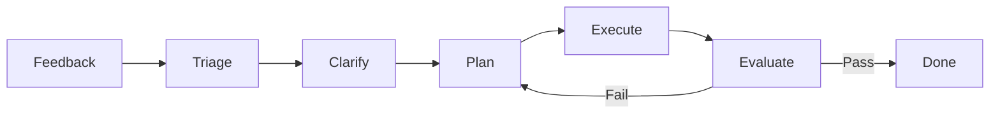

# AGENTS.md - {project_name}

> **Principle**: Keep this file to 50-100 lines. It is the agent map. Deep context (architecture, history, domain knowledge) lives in `docs/context.md`.

## 1. Project Overview

**{project_name}** is a Harness Engineering v2 project generated by `harness-init`. It provides a structured agent runtime with Planner, Generator, and Evaluator roles, wired together through a seven-stage workflow.

## 2. Agent Roles

### Planner
- Decomposes user requests into atomic tasks
- Produces JSON plans saved to `.harness/plans/`
- Defines acceptance criteria and task dependencies
- Uses `shlex.quote` for safe command generation

### Generator
- Executes individual plan tasks
- Generates or edits code under `src/{package_name}/`
- Follows `docs/context.md` for architecture and naming conventions

### Evaluator
- Validates Generator output in an isolated session
- Runs `make verify` (lint + tests with coverage >= 85%)
- Writes pass/fail feedback to `.harness/eval_feedback/`

## 3. Workflow

## 4. Key Constraints

- **Code style**: PEP 8, enforced by `ruff`
- **Test coverage**: >= 85%, enforced by `pytest-cov`
- **Function length**: <= 30 lines
- **File length**: <= 200 lines
- **Command execution**: Runner prefers `create_subprocess_exec`; falls back to `shell` only when necessary
- **State safety**: `StateManager` uses atomic write-then-rename to avoid JSON corruption
- **Documentation separation**: `AGENTS.md` is the map; `docs/context.md` holds deep context
- **Verification gate**: `make verify` must pass before any commit

## 5. File Mapping

| Type | Location | Description |
|------|----------|-------------|
| Agents | `src/{package_name}/agents/` | Planner, Generator, Evaluator implementations |
| Plans | `.harness/plans/` | JSON execution plans |
| Eval feedback | `.harness/eval_feedback/` | Evaluation reports and retry context |
| Deep context | `docs/context.md` | Architecture, conventions, common tasks |
| Entry point | `src/{package_name}/cli.py` | CLI commands: run, evaluate, status |
